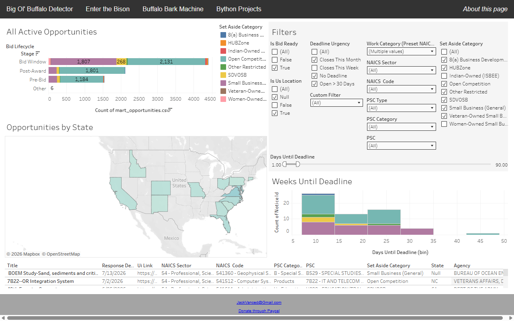

# Federal Capture Intelligence Platform

Interactive Tableau dashboard surfacing federal contracting and capture
intelligence. Opportunity data is pulled from the SAM.gov API and warehoused in
Snowflake (modeled with dbt), then explored through filterable views of
agencies, opportunities, and award trends.

**Live demo:** [bigolbuffalo.com/FederalCapture.html](https://bigolbuffalo.com/FederalCapture.html)

## Documentation

- [`docs/analytical_perspectives.md`](docs/analytical_perspectives.md) — the analytical lenses the dashboard is built around.
- [`docs/references.md`](docs/references.md) — data sources and reference material.
